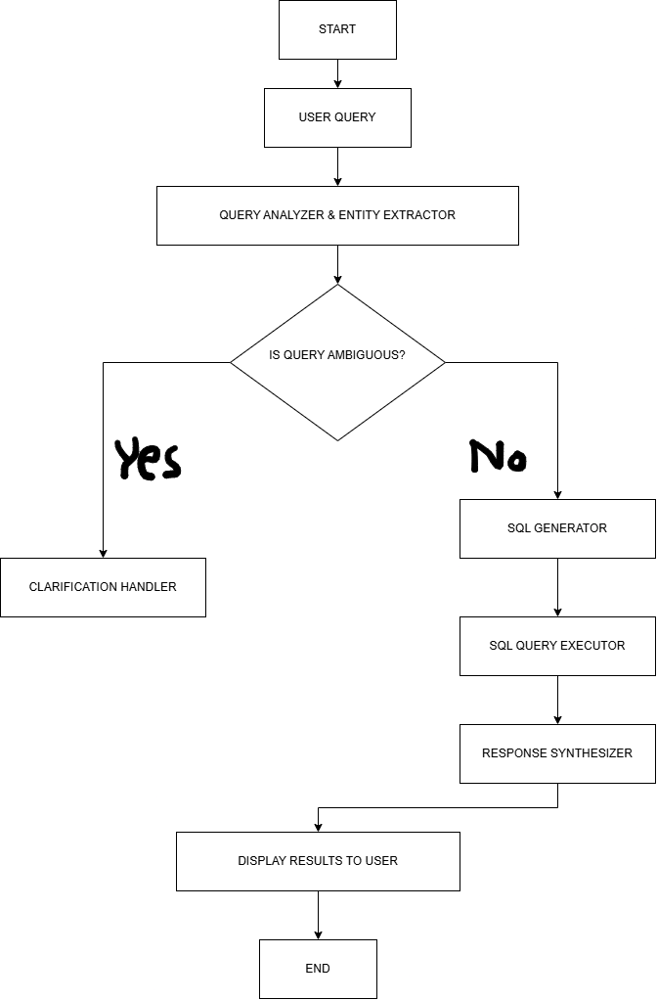
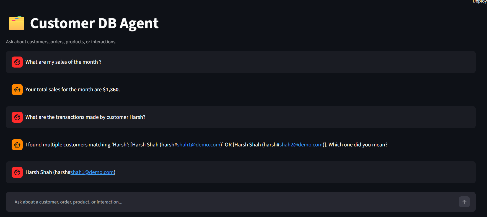
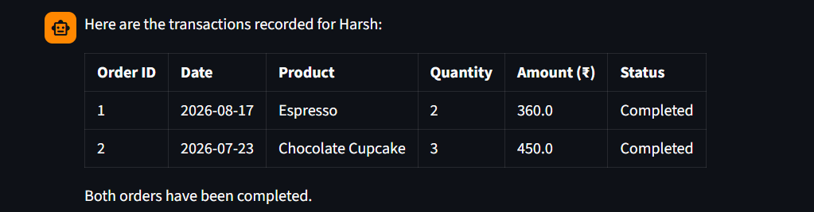

# 🤖 AI-Powered Customer DB Agent

An LLM-powered database agent that allows users to interact with customer data using **natural language**. The system analyzes user queries, extracts relevant entities and criteria, detects ambiguity, generates SQL queries, executes them against a SQLite database, and converts the retrieved results into a natural-language response.

The project uses **LangGraph** to orchestrate the complete agent workflow.

---

## 📌 Overview

Traditional database systems require users to have knowledge of SQL to retrieve information. This project provides a natural-language interface over a customer database, allowing users to ask questions without writing SQL manually.

For example, instead of writing:

```sql
SELECT *
FROM orders
WHERE customer_id = 101;
```

a user can simply ask:

> "Show me all orders placed by John."

The agent analyzes the request, identifies the relevant customer and database criteria, generates the required SQL query, executes it, and presents the result in a human-readable format.

---

## 🏗️ Architecture

The application is implemented as a **LangGraph stateful workflow** consisting of multiple nodes.

<p align="center">
  
</p>

## 🔄 Agent Workflow

### 1. Query Analyzer & Entity Extractor

The first node analyzes the user's natural-language request using an LLM with structured output.

It extracts information such as:

* Customer name
* Product name
* Temporal range
* Target table
* Query intent

The extracted information is stored in the agent state and used by subsequent nodes.

---

### 2. Customer Matching & Ambiguity Detection

When a customer name is present, the system searches the customer database for matching records.

If multiple customers match the provided name, the agent marks the query as ambiguous and generates a clarification question.

For example:

```text
User:
Show me the orders of John.

Agent:
I found multiple customers matching 'John':
[John Smith (...)] OR [John Doe (...)]
Which one did you mean?
```

After the user selects the appropriate customer, the workflow resumes and continues processing the original request.

---

### 3. SQL Generator

Once the query has been resolved, the SQL Generator creates a SQLite-compatible `SELECT` statement using:

* The original user query
* Extracted criteria
* Resolved customer information
* Database schema
* Temporal information

The agent is also instructed to correctly handle table relationships and joins.

Example:

```sql
SELECT p.product_name, o.quantity, o.amount, o.order_date
FROM orders o
JOIN products p
    ON o.product_id = p.product_id
WHERE o.customer_id = 101;
```

---

### 4. SQL Query Executor

The generated SQL query is executed against the SQLite database.

The returned records are converted into Python dictionaries and stored in the agent state for further processing.

---

### 5. Response Synthesizer

The raw database results are passed to the LLM along with the original user question.

The response synthesizer converts the database output into a concise, natural-language response.

For example:

```text
User:
How much has John spent?

Agent:
John has spent a total of ₹24,580 based on the available order records.
```

The user does not need to see or understand the underlying SQL query.

---

## 🧠 LangGraph State

The workflow maintains a shared state containing information such as:

```text
user_query
is_ambiguous
clarifying_question
resolved_selection
parsed_criteria
sql_query
query_results
error_message
final_answer
```

This allows information to flow between different nodes of the agent workflow.

The project also uses **LangGraph's `MemorySaver` checkpointing mechanism** to maintain workflow state during clarification and subsequent execution.

---

## 🗄️ Database Schema

The application currently uses a SQLite database named:

```text
customer_records.db
```

### Customers

| Column        | Description                |
| ------------- | -------------------------- |
| `customer_id` | Unique customer identifier |
| `first_name`  | Customer first name        |
| `last_name`   | Customer last name         |
| `email`       | Customer email             |
| `city`        | Customer city              |

### Products

| Column         | Description               |
| -------------- | ------------------------- |
| `product_id`   | Unique product identifier |
| `product_name` | Name of the product       |
| `category`     | Product category          |
| `price`        | Product price             |

### Orders

| Column        | Description             |
| ------------- | ----------------------- |
| `order_id`    | Unique order identifier |
| `customer_id` | ID of the customer      |
| `product_id`  | ID of the product       |
| `quantity`    | Quantity ordered        |
| `amount`      | Order amount            |
| `order_date`  | Date of the order       |
| `status`      | Order status            |

### Interactions

| Column             | Description                   |
| ------------------ | ----------------------------- |
| `interaction_id`   | Unique interaction identifier |
| `customer_id`      | ID of the customer            |
| `channel`          | Interaction channel           |
| `summary`          | Interaction summary           |
| `interaction_date` | Date of interaction           |

---

## ✨ Features

* 💬 Natural-language database interaction
* 🧠 LLM-powered query analysis
* 🔎 Entity and criteria extraction
* 👤 Customer matching
* ❓ Ambiguity detection
* 🔄 Interactive clarification workflow
* 📝 Automatic SQL generation
* 🗄️ SQLite database integration
* 📊 SQL query execution
* 🧾 Natural-language response generation
* 🔗 Stateful agent workflow using LangGraph
* 💾 Workflow checkpointing using `MemorySaver`

---

## 🛠️ Tech Stack

| Technology        | Purpose                               |
| ----------------- | ------------------------------------- |
| **Python**        | Core programming language             |
| **LangGraph**     | Agent workflow orchestration          |
| **LangChain**     | LLM integration                       |
| **Google Gemini** | Large Language Model                  |
| **Pydantic**      | Structured output / schema validation |
| **SQLite**        | Database                              |
| **Streamlit**     | User interface                        |
| **Rich**          | Terminal output and debugging         |

---

## 📂 Project Structure

```text
AI-Powered-Customer-DB-Agent/
│
├── app.py
├── agent.py
├── customer_records.db
├── requirements.txt
├── README.md
│
├── assets/
│   └── workflow.png
│
└── .gitignore
```

### File Description

**`app.py`**

Contains the Streamlit user interface for interacting with the agent.

**`agent.py`**

Contains the LangGraph workflow, agent state, query analysis, SQL generation, database execution, clarification handling, and response synthesis.

**`customer_records.db`**

SQLite database containing customer, product, order, and interaction records.

**`requirements.txt`**

Contains the Python dependencies required to run the project.

---

## ⚙️ Installation

### 1. Clone the Repository

```bash
git clone https://github.com/Chintan-2672/Customer-Database-Agent.git
cd Customer-Database-Agent
```

### 2. Create a Virtual Environment

```bash
python -m venv myenv
```

### 3. Activate the Environment

#### Windows

```bash
myenv\Scripts\activate
```

#### Linux / macOS

```bash
source myenv/bin/activate
```

### 4. Install Dependencies

```bash
pip install -r requirements.txt
```

---

## 🔐 Environment Variables

Create a `.env` file in the project root and add the required Google Gemini API credentials.

```env
GOOGLE_API_KEY=your_api_key
```

> **Never commit your `.env` file or API keys to GitHub.**

Add the following to `.gitignore`:

```text
.env
myenv/
__pycache__/
*.pyc
```

---

## ▶️ Running the Application

Start the Streamlit application:

```bash
python -m streamlit run app.py
```

The application will open in your browser.

---

## 💡 Example Queries

The agent can handle database-related questions such as:

```text
Show me all customers from Mumbai.
```

```text
Show me the orders placed by John last month.
```

```text
What products has this customer purchased?
```

```text
Show me all orders above ₹10,000.
```

```text
How many orders were placed last month?
```

The exact queries supported depend on the database schema and the capabilities of the SQL generation workflow.

---

## 📸 Application

Add screenshots of the Streamlit interface here.

<p align="center">
  
  
</p>

---

## 🚀 Future Improvements

* [ ] Add a dedicated intent-routing node for general conversations
* [ ] Improve detection of vague dates and incomplete queries
* [ ] Add SQL validation before execution
* [ ] Add automatic SQL error correction
* [ ] Support PostgreSQL and MySQL
* [ ] Improve handling of complex multi-step questions
* [ ] Add richer conversation memory
* [ ] Add authentication and role-based database access
* [ ] Add agent evaluation and query accuracy metrics

---

## 👨‍💻 Author

**Chintan Badve**

B.E. Artificial Intelligence & Data Science

---

## ⭐ Acknowledgement

This project was built to explore **LLM-powered database agents, structured output, and stateful agent workflows using LangGraph**.
